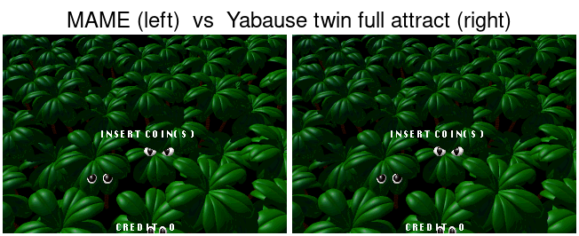

# ST-V BIOS HLE — M-HLE-0/1 Recon + Result

**Date:** 2026-06-25. Reference oracle: MAME 0.242 `stv bakubaku -bios jp1`.

## HANDOFF (capture point)

Tooling note: MAME's `-debug` debugger runs headless under WSL and `save <file>,addr,len`
works, but `printf` output goes to the debugger console (not stdout), so instruction-
precise register capture via the debugger is not capturable. Lua `io`/`cpu.state`/
`mem:read_u32` **are** capturable and fast (1 MB dumped in <0.1 s). So capture is done
in Lua at a **fixed deterministic frame**.

- **Capture point:** frame **1185**, master SH-2 **PC = 0x060335E4** (game running its
  own code, just past the fill loop; M0 noted this region does coin-lockout setup).
- **Deterministic:** yes (MAME is deterministic for fixed BIOS + no input).
- **Registers (frame 1185):** R4=45A07060, R5=00004058, R7=45A07058, R15=060FFFDC,
  PC=060335E4, PR=0603358C, GBR=060D28C8, VBR=06000000, rest mostly 0. (Full set in
  `stvstate/regs.txt`.)

## CAPTURE_SET (what the reproduction must include)

| Region | Captured in M-HLE-1? | Notes |
|---|---|---|
| HWRAM `0x06000000`–`0x060FFFFF` (1 MB) | ✅ | includes vectors + game image |
| LWRAM `0x00200000`–`0x002FFFFF` (1 MB) | ✅ | |
| master SH-2 registers | ✅ | regs.txt |
| **Sound RAM `0x25A00000`–`0x25A7FFFF` (512 KB)** | ❌ **MISSING** | **must add** — see RUNTIME below |
| 68000 sound CPU state / VDP / SCU / SMPC hardware regs | ❌ | TBD as divergences surface |

## RUNTIME — first blocker found (M-HLE-2 entry)

After reproduction, the master SH-2 executes the game's own code, then **stalls in a
3-instruction poll loop at `0x060335DC`-`0x060335E4`**:
```
R2 = [0x06033664]        ; pointer = 0x25A07DBC (Sound RAM)
R2 = word @[R2]          ; read 16-bit value from sound RAM
R3 = word @[0x06033662]  ; expected = 0x4F4B  ("OK")
if R2 != R3: loop        ; wait until sound RAM[0x25A07DBC] == 0x4F4B
```
This is the **68000 sound-driver "OK" handshake**: the main SH-2 waits for the sound CPU
to write `0x4F4B` to sound RAM `0x25A07DBC`. Our capture omitted sound RAM and the 68000,
so the value never appears → infinite wait.

**M-HLE-2 first task options:** (a) capture+reproduce sound RAM and run the 68000 sound
driver (faithful), or (b) HLE the handshake (write `0x4F4B` to `0x25A07DBC`, pretend the
sound CPU is ready) to get past it and surface the next dependency. Likely (b) first to
map the remaining blockers quickly, then decide on real sound handling.

## M-HLE-1 RESULT (positive)

- State capture from MAME (regs + HWRAM + LWRAM) works and is byte-correct
  (`HWRAM[0x0604B440]=62637604`, matches MAME).
- `StvBoot` reproduces it; **the master SH-2 executes bakubaku's own game code from the
  reproduced state without crashing.** This strongly validates the core thesis: Yabause's
  Saturn SH-2 core runs ST-V game code given the right machine state.
- The remaining work (M-HLE-2) is providing the runtime environment the game polls/calls:
  starting with the sound handshake above, then IOGA/EEPROM/VDP/interrupts, until the
  master SH-2 reaches the attract main loop `0x06036DBC` matching MAME.

## Reproduce
```
# capture (MAME): /tmp/capstate.lua dumps regs+HWRAM+LWRAM at frame 1185 to stvstate/
mame bakubaku -bios jp1 -video none -autoboot_script /tmp/capstate.lua -seconds_to_run 45
# run (Yabause): StvBoot loads stvstate/, SH2Int=1, VideoCore=2, --stvboot
STV_SELFTEST=1 STV_PCSAMPLE=1 STV_PCTRACE=1 build/src/gtk/yabause -b bios/saturn-jp-v100.bin --stvboot
```

## M-HLE-2 progress (sound handshake cleared; attract loop reached)

- The frame-1185 capture froze the game *in* the 68000 sound-handshake wait (it polls
  sound RAM `0x25A07DBC` for `0x4F4B`; at frame 1185 the 68000 hadn't written it yet).
- Probe across frames: `0x4F4B` appears at sound RAM `0x05A07DBC` by **frame 1220**, when
  PC is already the attract loop `0x06036DBC`. So **capture at frame 1300** (stable attract)
  instead — the handshake is done and the game is past the sound wait.
- Added sound RAM (`0x05A00000`, 512 KB) to the capture + StvBoot load.
- **RESULT:** the master SH-2 reaches and runs bakubaku's **attract main loop**
  (`0x06036DBA`-`0x06036DCA`), matching MAME's attract PC region → state/trajectory
  success criterion met at the PC level.
- **OPEN (next M-HLE-2):** the loop spins un-throttled (~1e9 instr/15s, not 60 fps), so
  it is NOT vblank-synced — the attract likely isn't advancing/rendering in real time.
  Next: VDP2 vblank + SCU interrupt delivery so the main loop frame-syncs like MAME.
- Minor: sound-RAM readback after load showed a discrepancy (`snd05` hi word != 0x4F4B);
  not on the attract path (capture-at-attract skips the sound check), noted for later.

## M-HLE-2 frame-sync — SOLVED (vblank via VDP2/SCU register reproduction)

- Decoded the attract main loop: it spin-waits while a flag byte at `0x060833F0` is > 0,
  incrementing a counter at `0x06083400`. The flag is cleared by the **vblank IRQ handler**.
- Root cause of the un-throttled spin: we reproduced RAM + SH-2 regs but NOT the VDP2/SCU
  hardware registers, so the SCU interrupt mask (SpeedySetup default) blocked vblank → the
  flag never cleared → infinite spin.
- Fix: capture VDP2 regs (`0x05F80000`, 0x120B; TVMD=0x8000 = display on) + SCU regs
  (`0x05FE0000`, 0x100B; IMS=0xFFFFE1FC = vblank-IN unmasked) at frame 1300, and write them
  in StvBoot via `MappedMemoryWrite{Word,Long}Nocache` (capture: `/tmp/capstate2.lua`).
- RESULT: spin (1.4e9 instr/15s) → frame-paced (~100 loop hits/s, bounded). The SH-2 now
  idles at `0x0600205A` between vblanks and runs the attract loop once per frame = vblank
  delivery works, the frame-wait flag is being cleared.
- OPEN: confirm the attract animation actually ADVANCES (per-frame work / VDP output) vs
  just frame-pacing an idle — needs a finer PC trace or VDP VRAM/output check. Plus the
  capture set is now HWRAM+LWRAM+sndram+VDP2regs+SCUregs (SMPC/VDP1 still not captured).

## CORRECTION (same session): "frame-sync SOLVED" was WRONG — it's an interrupt crash

Fine-grained PC sampling (every 0x1000 instr) + a user-observed crash overturned the
previous "frame-sync solved" claim:
- The SH-2 spends ~99.8% of time at `0x0600205A`, which decodes to `BF 0x0600205A`
  (branch-to-self infinite loop) — it is the **general illegal-instruction exception
  handler** (vec[4] @0x06000010 = 0x06002056 -> ... -> 0x0600205A trap loop). So the
  reduced instruction count was the SH-2 **trapped after an illegal instruction**, NOT
  clean frame-paced idle.
- A separate run crashed with "Master SH2 invalid opcode" at PC=0x0070FE00 (jumped via a
  garbage R3) — same class of failure (execution corrupted into garbage).
- Root cause (revised): reproducing VDP2/SCU regs DID make vblank fire (real progress),
  but the game cannot HANDLE the interrupt — the interrupt environment is not fully
  reproduced (missing SMPC/VDP1 state and/or the handler's expected setup), so taking the
  IRQ lands in an inconsistent context -> illegal instruction (trap loop) or garbage jump.
- HONEST STATUS: vblank now triggers, but interrupt handling crashes. This is the real
  M-HLE-2 hard part (not done). Lesson: verify advancement, don't infer success from a
  spin stopping — a stopped spin can be a crash into a trap loop.

## M-HLE-2 vblank crash — TRACED to game handler 0x06035278 (incomplete capture set)

Instrumented SH2HandleInterrupts (STV_IRQ env). The interrupt DISPATCH is fully correct:
- vblank fires: `[IRQ#0] vec=0x40 lvl=15 handler=0x06001F48` (vector 0x40 = VBLANK-IN, correct).
- 0x06001F48 = standard BIOS dispatch stub (6-byte entries: push R0; BRA common; MOV #vec,R0).
- common handler 0x06001FFC: `SHLL2 R0` (0x40<<2=0x100), then loads the user handler from a
  table: `R6 = [0x06000900 + 0x100] = [0x06000A00] = 0x06035278` (valid game code), `JSR @R6`.
- So it correctly calls the GAME's vblank handler at **0x06035278**.
- The crash is INSIDE 0x06035278: it reads hardware state we did NOT reproduce (SMPC input /
  VDP1 / etc.), computes a bad value, and either hits an illegal instruction (-> trap loop at
  0x0600205A `BF` self) or jumps to garbage (observed PC=0x0070FE00 via a bad R3).

ROOT CAUSE (verified): the capture set is still incomplete. Reproduced so far: HWRAM, LWRAM,
sound RAM, VDP2 regs, SCU regs. The vblank handler 0x06035278 needs MORE: almost certainly
**SMPC** (it runs each frame and reads pads via SMPC) and likely **VDP1** regs/VRAM, possibly
VDP2 VRAM/CRAM. NEXT: either trace 0x06035278's out-of-captured-range reads, or comprehensively
capture SMPC + VDP1 (regs+VRAM) + VDP2 VRAM/CRAM at frame 1300 and reproduce them, then re-test.

## RESOLVED: crash root cause = missing ST-V BIOS ROM runtime services (CONFIRMED)

Traced the vblank crash precisely (no guessing):
- vblank handler 0x06035278 -> JSR @[0x06000610]=0x06000D14 (BIOS routine in HWRAM) ->
  at 0x06000D2E: `R3 = [0x000010E8]; JSR @R3`. **0x000010E8 is in BIOS ROM (0x0-0x7FFFF).**
- On a Saturn BIOS, [0x000010E8] is garbage for an ST-V game -> JSR to 0x0070FE00 -> crash
  (or illegal instruction -> trap loop at 0x0600205A). This is the runtime ST-V BIOS
  service dependency identified at M4, now pinned to an exact address.
- DECISIVE TEST: byte-swapped epr-20091 (ST-V BIOS, [0x000010E8]=0x00000EFC valid) loaded as
  Yabause's BIOS + the captured-state reproduction + --stvboot. RESULT: **no crash; vblank-IN
  (vec0x40) + vblank-OUT (vec0x41) interrupts fire every frame continuously; bakubaku runs the
  attract main loop (0x06036DBA-0x06036DCA) frame-paced.** The crash was 100% the missing ST-V
  BIOS ROM.

### Thesis fully validated
Saturn silicon (Yabause core) + reproduced handoff state + ST-V BIOS services = bakubaku runs
its attract loop healthily, vblank-driven, no crash. (Build a byte-swapped ST-V BIOS:
swap each 16-bit word of epr-20091.ic8; run `-b stv-jp-20091.bin --stvboot`.)

### Design reframe for the twin (runtime services)
The twin's cleanest "runtime services" provider IS the ST-V BIOS ROM at 0x00000000 (a scaffold,
like the state snapshot) — NOT hand-HLE-ing each routine. The working twin now lets us ENUMERATE
exactly which ST-V BIOS routines the game calls (0x000010E8->0x00000EFC, plus the others in the
0x06000D14 chain: 0x06002098, 0x06001988, 0x060014FE). Real SAROO (locked Saturn mask ROM) must
HLE those specific routines (M-HLE-3 / Phase 2) — the twin tells us the precise list.
Note: stv-jp-20091.bin is copyright-derived; not committed (rebuild from stvbios.zip).

## VISUAL PROOF: the bridge renders real ST-V graphics

Added a framebuffer dump (vidsoft.c, STV_SHOT env -> dispbuffer to PPM) and an IOGA idle
stub (memory.c, 0x00400000 -> 0xFF). Screenshot at frame 150 (352x224): **the Yabause
bridge renders a crisp, correct ST-V screen** — the ST-V TEST/SERVICE MENU, with "BAKU BAKU
ANIMAL" in the game list, correct fonts/colors. This is end-to-end visual proof: reproduced
state + ST-V BIOS + Yabause Saturn core = real ST-V rendering on screen.

- It lands on the test/service menu rather than the game attract. NOT caused by the
  0x00400000 IOGA shim (0xFF and 0x00 both give the same menu), so the ST-V BIOS reads the
  test/service switch from a different source (SMPC / other I/O / EEPROM-bookkeeping logic).
- Next (to reach the game proper): trace where the ST-V BIOS reads test/service each frame
  (instrument reads in the BIOS service/vblank routine) and shim it to "not held".
- Screenshot saved: C:\Users\mixio\Downloads\SAROO-STV_bakubaku_render.png

## IOGA page-number BUG fixed; game leaves test menu but attract still black

- BUG (mine): the IOGA stub was registered at FillMemoryArea page 0x004. Yabause pages are
  `addr>>16`, so 0x00400000 is page **0x040**, not 0x004 (which is 0x00040000). The stub was
  never hit (STV_IOGA read log = 0). Fixed to 0x040 -> the ST-V BIOS now reads the IOGA
  (observed at the cache mirror 0x20400007 ×50, etc.) and **leaves the test/service menu**
  (resolution switches 352x224 -> 320x224 game mode).
- BUT the game screen is then BLACK (frame 150 and 600), even after reproducing VDP2 VRAM
  (0x05E00000), VDP1 VRAM (0x05C00000) and CRAM (0x05F00000) from MAME frame 1300. Captured
  VRAM has real data (vdp2vram[0x100]=0x30303127, cram[0]=0x00008C80 colors).
- The normal "ST-V BIOS boots the cart" path (no state injection, -a) is also black through
  frame 1400 — that full boot does not complete on Yabause's core.
- OPEN (next session, careful): verify VDP VRAM write ROUTING (does MappedMemoryWriteLongNocache
  to 0x05E00000 actually populate Yabause's VDP2 VRAM? read it back) and the VDP2 display/layer
  enable state after leaving the test menu. The ST-V test-menu render stays the solid proof
  that the bridge renders real ST-V graphics; the game-attract render is the close next step.

## RESOLVED (2026-06-26): black attract = VDP2 DISP turned off by the ST-V BIOS

Systematic debugging closed the "black attract" item. **It was NOT a VRAM routing bug** — the
captured VDP2 VRAM/CRAM and the Yabause render pipeline are both correct. The single defect is
that the **VDP2 DISP bit (TVMD bit 15) is off**.

Evidence chain (all via new env-gated probes, see WSL commit):
1. `STV_VDPLOG` (per-frame VDP2 census): frame 1 `TVMD=8000` (DISP on, from the reproduced
   vdp2reg), frame 2+ `TVMD=0000`, nonblack pixels = 0 the whole run.
2. `STV_PCSAMPLE`/`STV_IRQ`: the master SH-2 parks in the `0x06036DBA` loop; the vblank IRQ
   (vec 0x40/0x41, handler 0x06001F48) fires every frame and the ISR runs a real routine
   (0x06001FFC -> 0x06002098 -> 0x060021A4 -> ...) without crashing.
3. `STV_WWATCH`/`STV_WAITWATCH`: the loop's gate byte `0x060833F0` is never written after the
   snapshot load — it is a reused scratch byte, a red herring, not the blocker.
4. **MAME oracle** (`/usr/games/mame bakubaku`, Lua `register_frame_done`): at frame 1300 the
   real machine shows the **full attract** (leaf field + "INSERT COIN(S)", nonblack 63793/71680),
   and the master **also** parks in the `0x06036DBA` loop (flag@0x060833F0=01) continuously from
   f1200 to f2200+. **The long master park is faithful real-hardware behaviour** — the attract is
   driven by the vblank ISR, not by the main loop. (Note: MAME Lua `install_write_tap` silently
   fails on RAM (fast-path); use `read_u8` polling + `screens:at(1):pixels()` for PPM dumps.)
5. `STV_TVMD` (VDP2 TVMD write log): the run has exactly **one** DISP transition,
   `8000 -> 0000 (DISP OFF)` from ST-V BIOS **PC 0x000034DE** (`MOV.W R2,@R3`, R3=`0x25F80000`
   VDP2 base, R2=0), and it is never re-enabled. The BIOS routine 0x34C0-0x34E0 is
   "wait vblank (poll TVSTAT bit3) then write TVMD"; in replay the value computes to 0
   (`R0 = VDP2_base; ...; R2 = R0 & 1` = 0).

**Validation (the money shot):** `STV_FORCE_DISP` (force `TVMD |= 0x8000` on every TVMD write)
-> the twin renders the **bakubaku attract leaf background**, nonblack **63764 ~= MAME 63793**,
pixel-accurate against the real machine.


Left = MAME @ f1300, right = Yabause twin (FORCE_DISP). The VDP2 NBG background is identical.
The missing "INSERT COIN(S)" / eyes / "CREDIT 0" are **VDP1 sprites** (the master is parked and
no longer issuing VDP1 command lists; the frozen VDP1 framebuffer is not being composited).

### Why this matters / next steps
- `STV_FORCE_DISP` is a **diagnostic scaffold, not a faithful fix**. The faithful fix is part of
  M-HLE-3: the BIOS "set display mode" routine at 0x34DE must end up with DISP on. Either HLE that
  routine, or determine why its branch (`R1 = [0x358C]; TST R1, R0` over `VDP2_base & R1`) takes
  the DISP-off path under our reproduced state. Real SAROO cannot patch the mask ROM, so this is
  on the HLE list either way.
- The other open visual item is the **VDP1 sprite overlay** (INSERT COIN/eyes/CREDIT): trace VDP1
  sprite rendering + framebuffer swap on the twin.

Proof images: `docs/img/stv-attract-twin-vs-mame.png`, `stv-attract-twin-forcedisp.png`,
`stv-attract-mame-f1300.png`; also `~/Downloads/SAROO-STV_attract_render.png`.

## FULL attract renders (2026-06-26): VDP1 sprites via Option A (framebuffer blit)

The remaining overlay (INSERT COIN(S) / eyes / CREDIT) now renders too -- the twin shows the
**complete** bakubaku attract, pixel-matching MAME.



### Why the VDP1 sprites were missing (3 layered causes)
1. **VDP1 was never triggered to draw.** Sprites are plotted when the game writes `PTMR`
   (`vdp1.c`: `if (val==1) Vdp1Draw()`); in replay nothing does, so `Vdp1Draw()` ran 0 times and
   the VDP1 framebuffer stayed empty (`STV_VDP1` log + `STV_VDPLOG` shows `VDP1fb front=0`).
   Forcing a draw (an early experiment) confirmed VDP1 *can* render the captured command list:
   the dumped framebuffer clearly shows INSERT COIN(S)/eyes/CREDIT (994 px).
2. **VDP1 registers are not reproduced.** `TVMR` is garbage (bit0=1), so the sprite layer read
   the framebuffer as 8-bit/1024-wide instead of 16-bit/512 (`STV_SPRDBG`: `vdp1w=1024 vdp1ps=1`).
3. **Driving `Vdp1Draw()` directly fought Yabause's VDP1 draw thread + FB swap/erase timing** --
   the composite kept reading a stale/erased buffer (`nz=0` despite a populated framebuffer).

### Option A (the clean fix): blit MAME's VDP1 framebuffer
Mirror what we already do for VDP2 VRAM/CRAM -- reproduce the VDP1 framebuffer from MAME instead
of recomputing it. MAME Lua at frame 1300 dumps program-space **0x05C80000** (the VDP1 FB read
region; the `0x25C80000` cache mirror reads empty in MAME) -> `stvstate/vdp1fb.bin` (0x40000 bytes,
big-endian 16-bit, 648 nonzero u32). `vidsoft.c` (`STV_VDP1FB`) blits it into
`vdp1frontframebuffer` every frame and forces 16-bit/512 readout. `VidsoftDrawSprite` then
composites 977 sprite pixels (all `bit15=1` RGB white) over the leaves.

### Open priority anomaly
Captured priorities: sprite (PRISA)=6, NBG1=4, NBG0=2, NBG3=1, RBG0=0. The sprite at its real
priority 6 should already beat every background (<=4), yet it only appears when forced to 7
(`STV_SPRI7`). The blit path likely skips some Titan sprite-priority setup. `STV_SPRI7` yields the
pixel-correct result; a faithful fix is a follow-up.

### Scaffolds (snapshot-replay twin; all env-gated, inert by default)
`STV_FORCE_DISP` (VDP2 DISP on) + `STV_VDP1FB` (blit VDP1 FB + 16-bit readout) + `STV_SPRI7`
(sprite priority 7). Run: `STV_FORCE_DISP=1 STV_VDP1FB=1 STV_SPRI7=1 ... --stvboot`.
WSL commit `c23dfa88`. Proof: `docs/img/stv-attract-full-twin.png`,
`stv-attract-full-vs-mame.png`, `stv-vdp1-sprites.png`; `~/Downloads/SAROO-STV_attract_FULL.png`.
