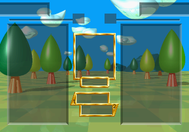
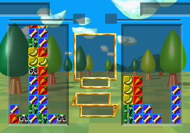

# Clean HLE 首帧里程碑

**日期：** 2026-07-12

## 结果

Yabause twin 已在 stock Saturn BIOS 下，用 `--stvboot` 快照入口和
`STV_CLEAN_HLE=1` 跑到 frame 300，并渲染完整的 BAKU BAKU ANIMAL 标题画面。
运行中 vblank-IN / vblank-OUT 连续触发，`STV_NOLOW=1` 没有记录主 SH-2 执行
ST-V BIOS 低地址字节。


复现命令：

```bash
DISPLAY=:0 \
STV_AUTOPLAY=1 STV_CLEAN_HLE=1 STV_NOLOW=1 STV_SHOT=300 \
./build/src/gtk/yabause -b bios/saturn-jp-v100.bin --stvboot
```

## 本轮实现

- `StvHleInstallRedirects()` 把 HWRAM dispatcher 的 `[0x10E8]` / `[0x10E4]`
  低 ROM 表读取改到 HWRAM sentinel，令解释器能在取 Saturn BIOS 指令前接管。
- `0x0EFC` vblank 时钟更新已原子 HLE，包括对 `0x20180001/03/05/07`
  strided 计数器的溢出更新。
- `0x372C` channel address helper 已 HLE。
- `0x3842` 已覆盖本次路径实际触达的 selector `0x00` 和 `0x10`，分别更新
  `0x06000840` 和 `0x06000830` 后 tail-jump 到 `[0x06000648]`。
- `0x4114` 暂时作为 snapshot-only scaffold：快照已经完成启动，首个 vblank
  中残留的 reset/service 条件会重复请求非返回式 boot；当前将这次重复 reset
  抑制并返回。它不是最终真机 boot HLE。

## 重要纠正

`PC=0x060335E4, R11=0` 不是安全主循环边界。该地址在当时 HWRAM 中为
`0xFFFF`，随后进入 `0x0600205A` illegal-instruction trap。精确 cache 捕获也证明
对应 cache line 无效，因此“代码只在 SH-2 cache”假设被否定。

## 当前边界

这个里程碑证明的是：**attract 快照 + Saturn BIOS + 当前 clean HLE 子集**可以
持续处理中断并渲染，不再需要执行 ST-V BIOS ROM。它还没有消除 MAME 快照，
也没有完成 `0x3842` 的其他 selector、真正的 `0x4114` boot 构造以及其余服务闭包。
下一步应扩大自动游玩帧数，让运行轨迹逐个暴露剩余 selector / 服务入口。

## 延长回归与崩溃修复

frame 300 首帧验证后，延长运行曾在 `PC=0x06038704` 报
`Master SH2 invalid opcode`。根因是 snapshot 路径错误复用了 trampoline 的
GBR 重定向方案，把 `0x06038704` 当作空闲指针槽写入 `0x00003E4E`；完整 attract
快照中该地址实际是游戏代码。已从 `StvHleInstallRedirects()` 删除
`0x06038704`、`0x060105E0` 和 `0x060134B0` 三组 snapshot 不需要的 game-site
补丁，只保留 resident dispatcher 重定向。

随后自动游玩又触达 `0x3842` selector `0x01` 和 `0x20`，现已实现 delta 累加
与 range 更新分支。最终相同配置连续运行 120 秒，结果为：

- 无 `STV_INVALID`；
- 无 `LOWEDGE` / `LOWPC`；
- 无新的 unimplemented HLE entry；
- vblank 与标题画面持续运行。

## 自动游玩进入游戏

原 `STV_AUTOPLAY` 要到 emulator frame 3000 才开始周期投币；debug interpreter
下 210 秒也只到 frame 1800，所以标题画面没有推进。`--stvboot` 本身已从 attract
开始，现将投币/开始窗口提前到 frame 300（from-scratch 路径也能容忍尚未读取时
的重复 active-low 脉冲）。

调整后在 Saturn BIOS + clean HLE 下运行到 frame 1200，已经进入实际游戏场景：



该次运行同样没有 `STV_INVALID`、`LOWEDGE`、`LOWPC` 或新的 unimplemented HLE。

## 3600 帧连续游戏回归

使用相同的 clean HLE 配置继续运行约 478 秒，并在 frame 1800、2400、3600
分别取帧。三张画面中的棋盘和堆叠状态持续变化，确认模拟器不是停在静态画面，
而是在连续执行实际游戏逻辑。



本次长跑结果：

- 无 `Master SH2 invalid opcode`；
- 无 `LOWEDGE` / `LOWPC`，主 SH-2 没有回落执行 ST-V BIOS 低地址代码；
- 无新的 unimplemented HLE entry 或未知 `0x3842` selector；
- 自动投币/开始后可进入游戏，并稳定推进到 frame 3600。

复现命令：

```bash
DISPLAY=:0 \
STV_AUTOPLAY=1 STV_CLEAN_HLE=1 STV_NOLOW=1 STV_INVALID=1 \
STV_BIOSCALL=1 STV_HLE_TRACE=1 STV_SHOT=1800,2400,3600 \
./build/src/gtk/yabause -b bios/saturn-jp-v100.bin --stvboot
```
